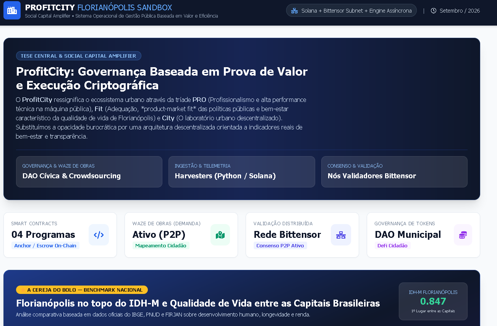

Welcome to my GH Space. Here I'll share some of my last prototypes.

Omni Research Engine | Automated Financial Reports / SNAPSHOTS | B2B / B2C

Profitcity | Social Capital Amplifier (Public Expenses on Blockchain) 

MutaGen.t Protocol | LLM Treasury + Darwin's Social Trading. The theory of evolution applied to Financial Autonomous Agents (Web3)

CONVERTIO | USDT to Pix converter (Without login with KYC to 10k+ transactions) 

